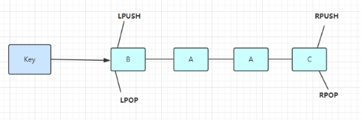
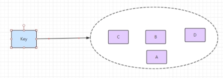
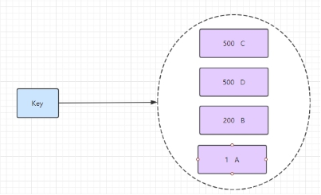
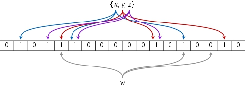

# ***\*Redis常见\*******\*知识点\****

http://jasontec.cn/articles/2019/12/20/1576826633007.html

 

介绍：Redis 是一个开源的使用 ANSI C 语言编写、遵守 BSD 协议、支持网络、可基于内存亦可持久化的日志型、Key-Value 数据库，并提供多种语言的 API的非关系型数据库。

 

传统数据库遵循 ACID 规则。而 Nosql（Not Only SQL 的缩写，是对不同于传统的关系型数据库的数据库管理系统的统称） 一般为分布式而分布式一般遵循 CAP 定理。

 

Github 源码：https://github.com/antirez/redis

 

Redis 官网：https://redis.io/

 

 

 

## Redis支持的数据类型？

 

### ***\*String字符串：\****

是redis中最基本的数据类型，一个key对应一个value。

String类型是二进制安全的，意思是 redis 的 string 可以包含任何数据。如数字，字符串，jpg图片或者序列化的对象。

格式: set key value

 

string类型是二进制安全的。意思是redis的string可以包含任何数据。比如jpg图片或者序列化的对象 。

在 C 语言中，字符串里面不能包含空字符，否则这个空字符会被当做是字符串结尾，换句话说，C 语言的字符串默认是以 '\0' 结尾的，这不是二进制安全的，因为图片、音频等二进制数据里面会有 '\0' 这一字符，C 字符串会忽略 '\0' 这一字符后面的数据。在 Redis 中，有这样一个结构：

struct sdshdr {

  int len; int free; char buf[]; }; 

它是用来表示字符串值的，称为 SDS(simple dynamic string)， buf 是一个 char 类型的数组，用来保存二进制数据，len 记录字符串的长度（不一定是 buf 数组的长度），SDS 不使用空字符串，而是使用 len 的值来判断字符串是否结束，因此 Redis 可以保存特殊数据格式，包括二进制数据。

 

如果要给二进制安全一个定义的话，可以这样描述：一个函数或方法能将任意输入作为原始的，无任何特殊格式意义的数据流，那么它就是二进制安全的。

string类型是Redis最基本的数据类型，一个键最大能存储512MB。

 

使用：get 、 set 、 del 、 incr、 decr 等

 

实战场景：

 

1.缓存： 经典使用场景，把常用信息，字符串，图片或者视频等信息放到redis中，redis作为缓存层，mysql做持久化层，降低mysql的读写压力。

 

2.计数器：redis是单线程模型，一个命令执行完才会执行下一个，同时数据可以一步落地到其他的数据源。

 

3.session：常见方案spring session + redis实现session共享，

 

 

### ***\*Hash（哈希）\****

 

格式: hmset name  key1 value1 key2 value2

 

Redis hash 是一个键值(key=>value)对集合。

 

Redis hash是一个string类型的field和value的映射表，hash特别适合用于存储对象。

 

是一个Mapmap，指值本身又是一种键值对结构，如 value={{field1,value1},......fieldN,valueN}}

 

使用：所有hash的命令都是  h  开头的hget  、hset 、  hdel 等

 

实战场景：

 

1.缓存： 能直观，相比string更节省空间，的维护缓存信息，如用户信息，视频信息等。

 

### ***\*List（列表）\****

List 说白了就是链表（redis 使用双端链表实现的 List），是有序的，value可以重复，可以通过下标取出对应的value值，左右两边都能进行插入和删除数据。

 

使用列表的技巧

 

lpush+lpop=Stack(栈)

lpush+rpop=Queue（队列）

lpush+ltrim=Capped Collection（有限集合）

lpush+brpop=Message Queue（消息队列）

 

Redis 列表是简单的字符串列表，按照插入顺序排序。你可以添加一个元素到列表的头部（左边）或者尾部（右边）

 

格式: lpush  name  value

在 key 对应 list 的头部添加字符串元素

 

格式: rpush  name  value

在 key 对应 list 的尾部添加字符串元素

 

格式: lrem name  index

key 对应 list 中删除 count 个和 value 相同的元素

 

格式: llen name  

返回 key 对应 list 的长度

 

Redis Ltrim 对一个列表进行修剪(trim)，就是说，让列表只保留指定区间内的元素，不在指定区间之内的元素都将被删除。

下标 0 表示列表的第一个元素，以 1 表示列表的第二个元素，以此类推。 你也可以使用负数下标，以 -1 表示列表的最后一个元素， -2 表示列表的倒数第二个元素，以此类推。

语法

redis Ltrim 命令基本语法如下：

redis 127.0.0.1:6379> LTRIM KEY_NAME START STOP

 

Redis Brpop 命令移出并获取列表的最后一个元素， 如果列表没有元素会阻塞列表直到等待超时或发现可弹出元素为止。

语法

redis Brpop 命令基本语法如下：

redis 127.0.0.1:6379> BRPOP LIST1 LIST2 .. LISTN TIMEOUT 

返回值

假如在指定时间内没有任何元素被弹出，则返回一个 nil 和等待时长。 反之，返回一个含有两个元素的列表，第一个元素是被弹出元素所属的 key ，第二个元素是被弹出元素的值。

 

List实战场景：

 

1.timeline：例如微博的时间轴，有人发布微博，用lpush加入时间轴，展示新的列表信息。

 

 

### ***\*Set（集合）\****

 

格式: sadd  name  value

 

Redis的Set是string类型的无序集合。

 

集合是通过哈希表实现的，所以添加，删除，查找的复杂度都是O(1)。

 

Set  集合

集合类型也是用来保存多个字符串的元素，但和列表不同的是集合中  1. 不允许有重复的元素，2.集合中的元素是无序的，不能通过索引下标获取元素，3.支持集合间的操作，可以取多个集合取交集、并集、差集。

 

 

 

 

 

 

 

使用：命令都是以s开头的  sset 、srem、scard、smembers、sismember

实战场景;

1.标签（tag）,给用户添加标签，或者用户给消息添加标签，这样有同一标签或者类似标签的可以给推荐关注的事或者关注的人。

2.点赞，或点踩，收藏等，可以放到set中实现

 

### ***\*zset(sorted set：有序集合)\****

 

格式: zadd  name score value

 

Redis zset 和 set 一样也是string类型元素的集合,且不允许重复的成员。

 

不同的是每个元素都会关联一个double类型的分数。redis正是通过分数来为集合中的成员进行从小到大的排序。

 

有序集合和集合有着必然的联系，保留了集合不能有重复成员的特性，区别是，有序集合中的元素是可以排序的，它给每个元素设置一个分数，作为排序的依据。

 

（有序集合中的元素不可以重复，但是score 分数 可以重复，就和一个班里的同学学号不能重复，但考试成绩可以相同）。

 

 

 

zset的成员是唯一的,但分数(score)却可以重复。

使用： 有序集合的命令都是 以  z  开头   zadd 、 zrange、 zscore

实战场景：

 

1.排行榜：有序集合经典使用场景。例如小说视频等网站需要对用户上传的小说视频做排行榜，榜单可以按照用户关注数，更新时间，字数等打分，做排行。

 

 

 

 

## 什么是Redis持久化？Redis有哪几种持久化方式？优缺点是什么？

 

持久化就是把内存的数据写到磁盘中去，防止服务宕机了内存数据丢失。

 

Redis 提供了两种持久化方式:RDB（默认） 和AOF 

 

### ***\*RDB：\****

 

rdb是Redis DataBase缩写

 

功能核心函数两个函数

rdbSave：生成RDB文件

rdbLoad：从文件加载内存

 

 

 

### ***\*AOF:\****

 

Aof是Append-only file缩写

 

 

 

每当执行服务器(定时)任务或者函数时flushAppendOnlyFile 函数都会被调用， 这个函数执行以下两个工作

 

aof写入保存：

 

WRITE：根据条件，将 aof_buf 中的缓存写入到 AOF 文件

 

SAVE：根据条件，调用 fsync 或 fdatasync 函数，将 AOF 文件保存到磁盘中。

 

存储结构:

 

 内容是redis通讯协议(RESP )格式的命令文本存储。

 

比较：

 

1、aof文件比rdb更新频率高，优先使用aof还原数据。

 

2、aof比rdb更安全也更大

 

3、rdb性能比aof好

 

4、如果两个都配了优先加载AOF

 

刚刚上面你有提到redis通讯协议(RESP )，能解释下什么是RESP？有什么特点？（可以看到很多面试其实都是连环炮，面试官其实在等着你回答到这个点，如果你答上了对你的评价就又加了一分）

 

RESP 是redis客户端和服务端之前使用的一种通讯协议；

 

RESP 的特点：实现简单、快速解析、可读性好

 

For Simple Strings the first byte of the reply is "+" 回复

 

For Errors the first byte of the reply is "-" 错误

 

For Integers the first byte of the reply is ":" 整数

 

For Bulk Strings the first byte of the reply is "$" 字符串

 

For Arrays the first byte of the reply is "*" 数组

 

 

 

## Redis 有哪些架构模式？讲讲各自的特点

 

### ***\*单机版\****

 

 

 

特点：简单

 

问题：

 

1、内存容量有限 2、处理能力有限 3、无法高可用。

 

### ***\*主从复制\****

 

 

 

Redis 的复制（replication）功能允许用户根据一个 Redis 服务器来创建任意多个该服务器的复制品，其中被复制的服务器为主服务器（master），而通过复制创建出来的服务器复制品则为从服务器（slave）。 只要主从服务器之间的网络连接正常，主从服务器两者会具有相同的数据，主服务器就会一直将发生在自己身上的数据更新同步 给从服务器，从而一直保证主从服务器的数据相同。

 

特点：

 

1、master/slave 角色

 

2、master/slave 数据相同

 

3、降低 master 读压力在转交从库

 

问题：

 

无法保证高可用

 

没有解决 master 写的压力

 

### ***\*哨兵\****

 

 

 

Redis sentinel 是一个分布式系统中监控 redis 主从服务器，并在主服务器下线时自动进行故障转移。其中三个特性：

 

监控（Monitoring）：   Sentinel  会不断地检查你的主服务器和从服务器是否运作正常。

 

提醒（Notification）： 当被监控的某个 Redis 服务器出现问题时， Sentinel 可以通过 API 向管理员或者其他应用程序发送通知。

 

自动故障迁移（Automatic failover）： 当一个主服务器不能正常工作时， Sentinel 会开始一次自动故障迁移操作。

 

特点：

 

1、保证高可用

 

2、监控各个节点

 

3、自动故障迁移

 

缺点：

主从模式，切换需要时间

丢数据

没有解决 master 写的压力

 

### ***\*集群（proxy 型）：\****

 

 

 

Twemproxy 是一个 Twitter 开源的一个 redis 和 memcache 快速/轻量级代理服务器； Twemproxy 是一个快速的单线程代理程序，支持 Memcached ASCII 协议和 redis 协议。

 

特点：

1、多种 hash 算法：MD5、CRC16、CRC32、CRC32a、hsieh、murmur、Jenkins 

 

2、支持失败节点自动删除

 

3、后端 Sharding 分片逻辑对业务透明，业务方的读写方式和操作单个 Redis 一致

 

缺点：增加了新的 proxy，需要维护其高可用。

 

 

 

failover 逻辑需要自己实现，其本身不能支持故障的自动转移，可扩展性差，进行扩缩容都需要手动干预

 

### ***\*集群（直连型）：\****

 

 

 

从redis 3.0之后版本支持redis-cluster集群，Redis-Cluster采用无中心结构，每个节点保存数据和整个集群状态,每个节点都和其他所有节点连接。

 

特点：

 

1、无中心架构（不存在哪个节点影响性能瓶颈），少了 proxy 层。

 

2、数据按照 slot 存储分布在多个节点，节点间数据共享，可动态调整数据分布。

 

3、可扩展性，可线性扩展到 1000 个节点，节点可动态添加或删除。

 

4、高可用性，部分节点不可用时，集群仍可用。通过增加 Slave 做备份数据副本

 

5、实现故障自动 failover（故障转移），节点之间通过 gossip 协议交换状态信息，用投票机制完成 Slave到 Master 的角色提升。

 

缺点：

 

1、资源隔离性较差，容易出现相互影响的情况。

 

2、数据通过异步复制,不保证数据的强一致性

 

 

 

什么是一致性哈希算法？什么是哈希槽？

 

这两个问题篇幅过长 网上找了两个解锁的不错的文章

 

https://www.cnblogs.com/lpfuture/p/5796398.html

 

http://www.jasontec.cn/articles/2020/04/11/1586586130767.html

 

 

 

## Redis常用命令？

 

Keys pattern

 

*表示区配所有

 

以bit开头的

 

查看Exists  key是否存在

 

Set

 

设置 key 对应的值为 string 类型的 value。

 

setnx

 

设置 key 对应的值为 string 类型的 value。如果 key 已经存在，返回 0，nx 是 not exist 的意思。

 

删除某个key

 

第一次返回1 删除了 第二次返回0

 

Expire 设置过期时间（单位秒）

 

TTL查看剩下多少时间

 

返回负数则key失效，key不存在了

 

Setex

 

设置 key 对应的值为 string 类型的 value，并指定此键值对应的有效期。

 

Mset

 

一次设置多个 key 的值，成功返回 ok 表示所有的值都设置了，失败返回 0 表示没有任何值被设置。

 

Getset

 

设置 key 的值，并返回 key 的旧值。

 

Mget

 

一次获取多个 key 的值，如果对应 key 不存在，则对应返回 nil。

 

Incr

 

对 key 的值做加加操作,并返回新的值。注意 incr 一个不是 int 的 value 会返回错误，incr 一个不存在的 key，则设置 key 为 1

 

incrby

 

同 incr 类似，加指定值 ，key 不存在时候会设置 key，并认为原来的 value 是 0

 

Decr

 

对 key 的值做的是减减操作，decr 一个不存在 key，则设置 key 为-1

 

Decrby

 

同 decr，减指定值。

 

Append

 

给指定 key 的字符串值追加 value,返回新字符串值的长度。

 

Strlen

 

取指定 key 的 value 值的长度。

 

persist xxx(取消过期时间)

 

选择数据库（0-15库）

 

Select 0 //选择数据库

 

move age 1//把age 移动到1库

 

Randomkey随机返回一个key

 

Rename重命名

 

Type 返回数据类型

 

08

 

## 使用过Redis分布式锁么，它是怎么实现的？

 

 

 

先拿setnx来争抢锁，抢到之后，再用expire给锁加一个过期时间防止锁忘记了释放。

 

如果在setnx之后执行expire之前进程意外crash或者要重启维护了，那会怎么样？

 

set指令有非常复杂的参数，这个应该是可以同时把setnx和expire合成一条指令来用的！

 

单节点Redis实现一个简单的分布式锁。

 

1、加锁

加锁实际上就是在redis中，给Key键设置一个值，为避免死锁，并给定一个过期时间。

 

SET lock_key random_value NX PX 5000

 

值得注意的是：

random_value 是客户端生成的唯一的字符串。

NX 代表只在键不存在时，才对键进行设置操作。

PX 5000 设置键的过期时间为5000毫秒。

 

这样，如果上面的命令执行成功，则证明客户端获取到了锁。

 

2、解锁

解锁的过程就是将Key键删除。但也不能乱删，不能说客户端1的请求将客户端2的锁给删除掉。这时候random_value的作用就体现出来。

 

为了保证解锁操作的原子性，我们用LUA脚本完成这一操作。先判断当前锁的字符串是否与传入的值相等，是的话就删除Key，解锁成功。

 

 

if redis.call('get',KEYS[1]) == ARGV[1] then 

  return redis.call('del',KEYS[1]) 

else

  return 0 

end

 

 

 

## 使用过Redis做异步队列么，你是怎么用的？有什么缺点？

### ***\*用法\****

一般使用list结构作为队列，rpush生产消息，lpop消费消息。当lpop没有消息的时候，要适当sleep一会再重试。

 

### ***\*缺点：\****

 

在消费者下线的情况下，生产的消息会丢失，得使用专业的消息队列如rabbitmq等。

 

能不能生产一次消费多次呢？

 

使用pub/sub主题订阅者模式，可以实现1:N的消息队列。

 

 

 

## 什么是缓存穿透？如何避免？什么是缓存雪崩？何如避免？

 

### ***\*缓存穿透\****

 

一般的缓存系统，都是按照key去缓存查询，如果不存在对应的value，就应该去后端系统查找（比如DB）。一些恶意的请求会故意查询不存在的key,请求量很大，就会对后端系统造成很大的压力。这就叫做缓存穿透。

 

### ***\*如何避免？\****

 

1：对查询结果为空的情况也进行缓存，缓存时间设置短一点，或者该key对应的数据insert了之后清理缓存。

 

2：对一定不存在的key进行过滤。可以把所有的可能存在的key放到一个大的Bitmap中，查询时通过该bitmap过滤。

 

### ***\*缓存雪崩\****

 

当缓存服务器重启或者大量缓存集中在某一个时间段失效，这样在失效的时候，会给后端系统带来很大压力。导致系统崩溃。

 

### ***\*如何避免？\****

 

1：在缓存失效后，通过加锁或者队列来控制读数据库写缓存的线程数量。比如对某个key只允许一个线程查询数据和写缓存，其他线程等待。

 

2：做二级缓存，A1为原始缓存，A2为拷贝缓存，A1失效时，可以访问A2，A1缓存失效时间设置为短期，A2设置为长期

 

3：不同的key，设置不同的过期时间，让缓存失效的时间点尽量均匀。

 

## 布隆过滤器

布隆过滤器（Bloom Filter）是1970年由布隆提出的。

它实际上是一个很长的二进制向量和一系列随机映射函数。布隆过滤器可以用于检索一个元素是否在一个集合中。

优点是空间效率和查询时间都比一般的算法要好的多

缺点是有一定的误识别率和删除困难。

### ***\*基本概念\****

直观的说，bloom算法类似一个hash set，用来判断某个元素（key）是否在某个集合中。

和一般的hash set不同的是，这个算法无需存储key的值，对于每个key，只需要k个比特位，每个存储一个标志，用来判断key是否在集合中。

 

算法：

\1. 首先需要k个hash函数，每个函数可以把key散列成为1个整数

\2. 初始化时，需要一个长度为n比特的数组，每个比特位初始化为0

\3. 某个key加入集合时，用k个hash函数计算出k个散列值，并把数组中对应的比特位置为1

\4. 判断某个key是否在集合时，用k个hash函数计算出k个散列值，并查询数组中对应的比特位，如果所有的比特位都是1，认为在集合中。

 

优点：不需要存储key，节省空间

 

缺点：

\1. 算法判断key在集合中时，有一定的概率key其实不在集合中

\2. 无法删除

 

典型的应用场景：

比如在字处理软件中，需要检查一个英语单词是否拼写正确（也就是要判断 它是否在已知的字典中）；在 FBI，一个嫌疑人的名字是否已经在嫌疑名单上；在网络爬虫里，一个网址是否被访问过等等。

某些存储系统的设计中，会存在空查询缺陷：当查询一个不存在的key时，需要访问慢设备，导致效率低下。

比如一个前端页面的缓存系统，可能这样设计：先查询某个页面在本地是否存在，如果存在就直接返回，如果不存在，就从后端获取。但是当频繁从缓存系统查询一个页面时，缓存系统将会频繁请求后端，把压力导入后端。

 

这是只要增加一个bloom算法的服务，后端插入一个key时，在这个服务中设置一次

需要查询后端时，先判断key在后端是否存在，这样就能避免后端的压力。

 

 